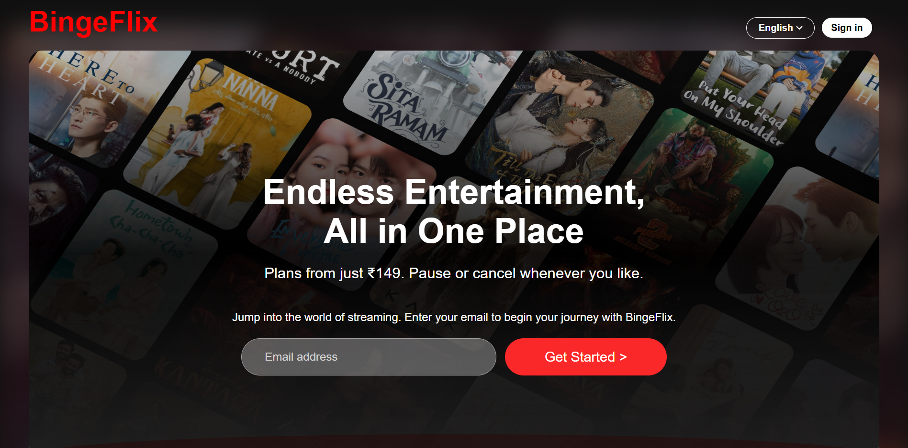
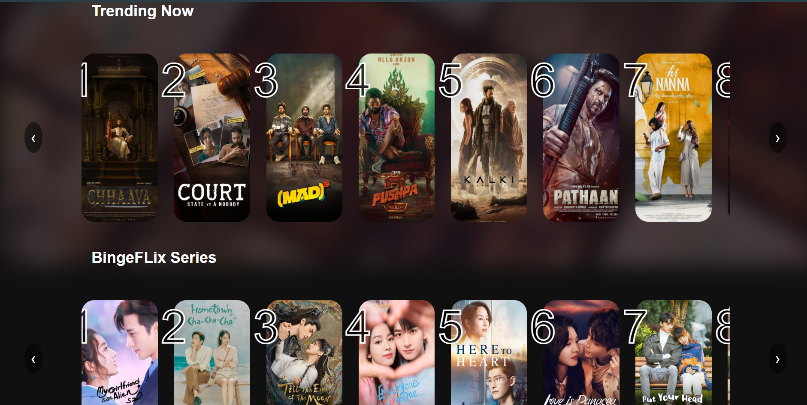
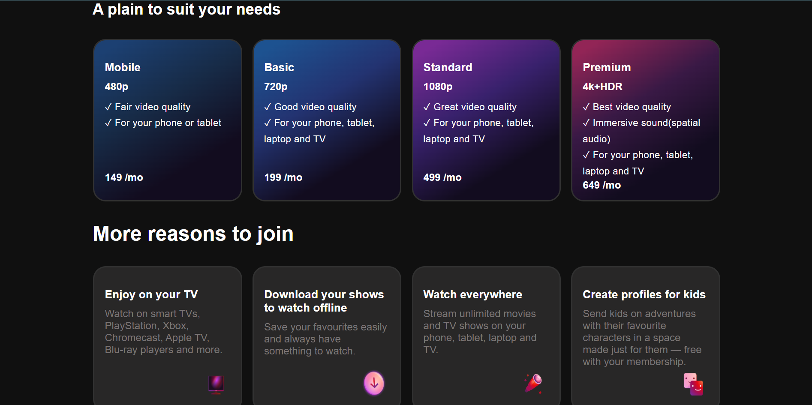
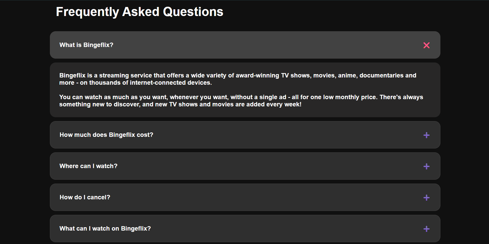
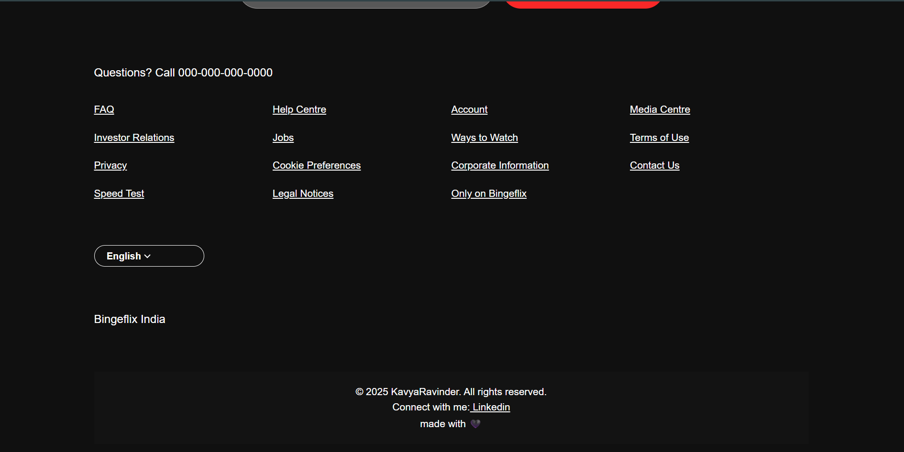

# 🎬 BingeFlix – Netflix Clone (HTML & CSS)

**BingeFlix** is a front-end clone of Netflix designed to showcase clean UI layout, styling, and responsive design using only **HTML** and **CSS**. It simulates the feel of a real streaming service with visually appealing sections like banners, carousels, plans, FAQs, and more — all without using JavaScript. Under the guidance of LetsUp Grade, I built and implemented additional features!!

## 💻 Tech Stack
- **HTML5**
- **CSS3**

## 🌟 Key Features
- ✅ Netflix-inspired responsive UI
- ✅ Hero banner(designed using canva) with email input and CTA
- ✅ Trending and Series image carousels (scrollable)
- ✅ Attractive pricing plans with gradients
- ✅ Reasons-to-join section with visuals
- ✅ CSS-only collapsible FAQ accordion
- ✅ Fully responsive design for mobile, tablet, and desktop
- ✅ Clean and structured code with well-organized sections

## 🖼️ Screenshots






## 🚀 Getting Started

To run this project on your local machine:

1. Clone the repository:
   ```bash
   git clone https://github.com/gajulakavya12/bingeflix.git

2. Navigate to the project folder and open index.html in your browser:
   cd bingeflix

3. That's it! Explore the Netflix-style experience locally.

## 📂 Folder Structure

bingeflix/
├── index.html
├── style.css
└── assets/
    └── [images and banners]

## 📌 Note
- This is a static front-end project built for educational and portfolio purposes.

- All media (images, titles) are used for demonstration only.

🙋‍♀️ Author

Made with 🖤 by [Kavya](https://www.linkedin.com/in/gajulakavya12/)